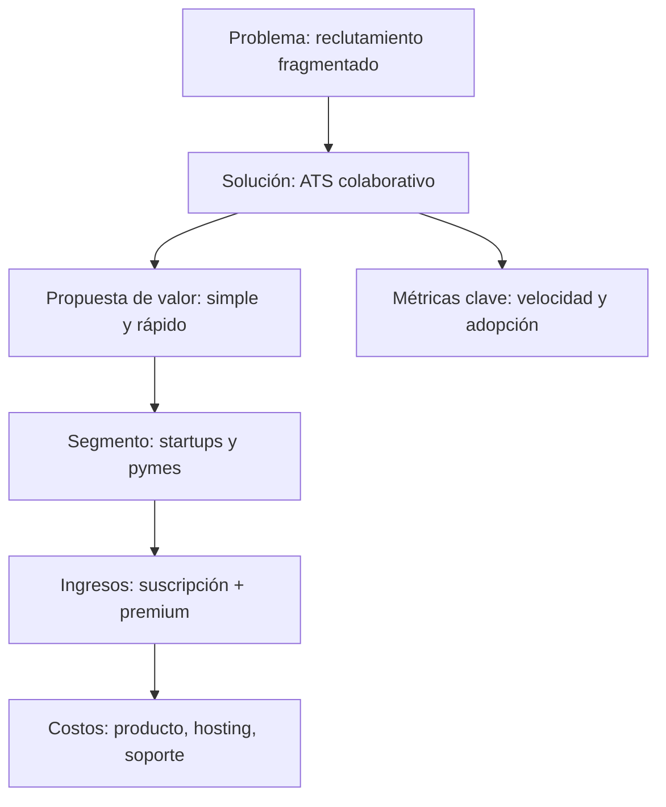
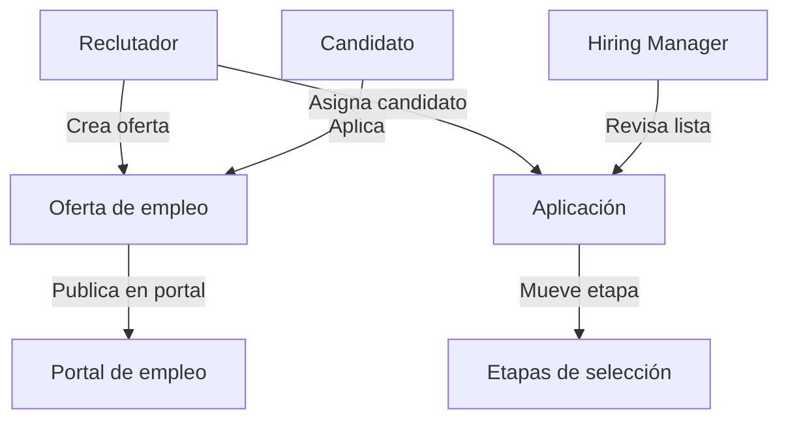
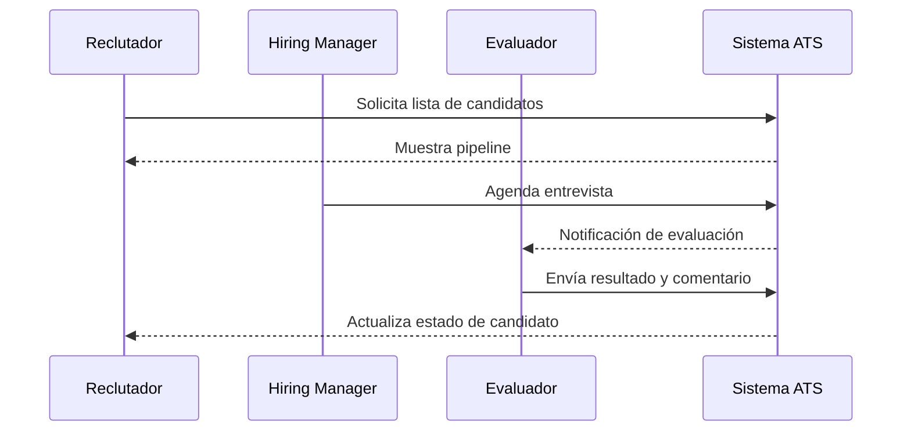
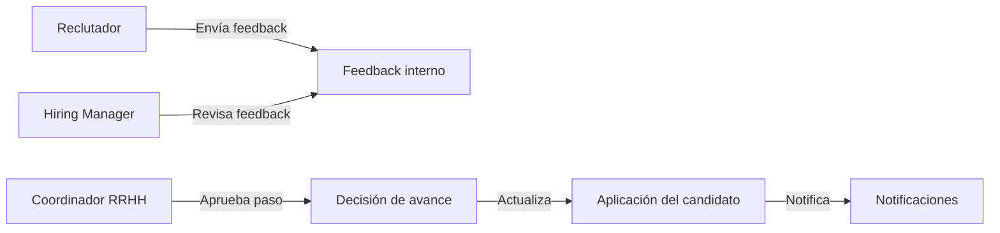
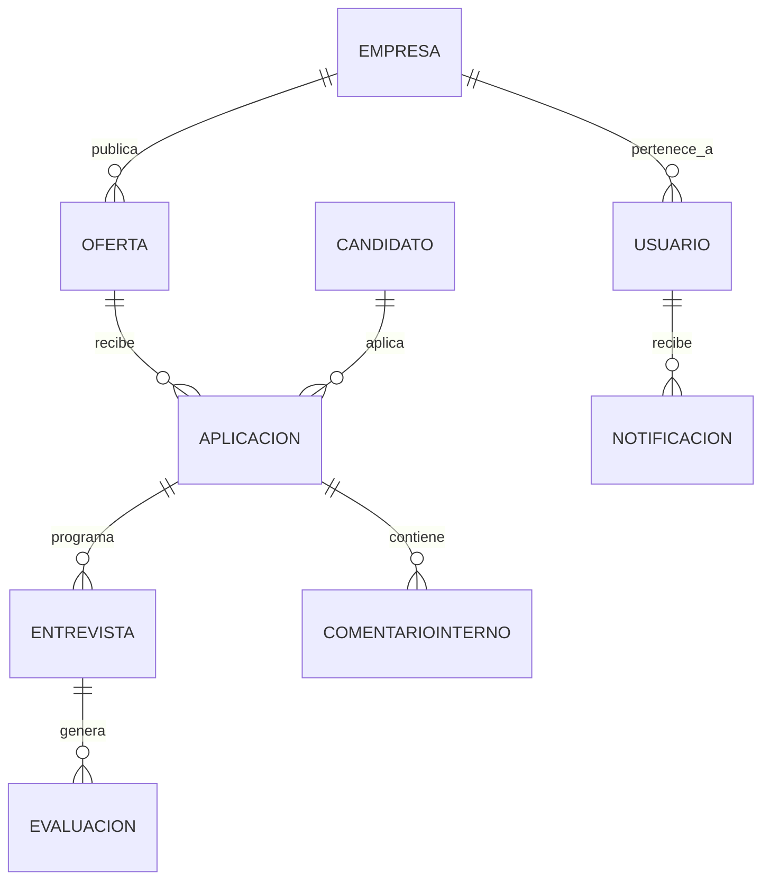
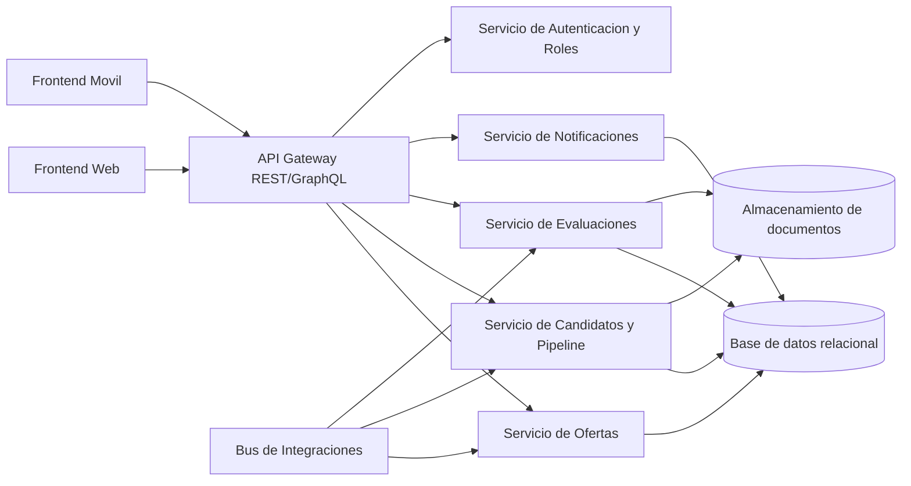
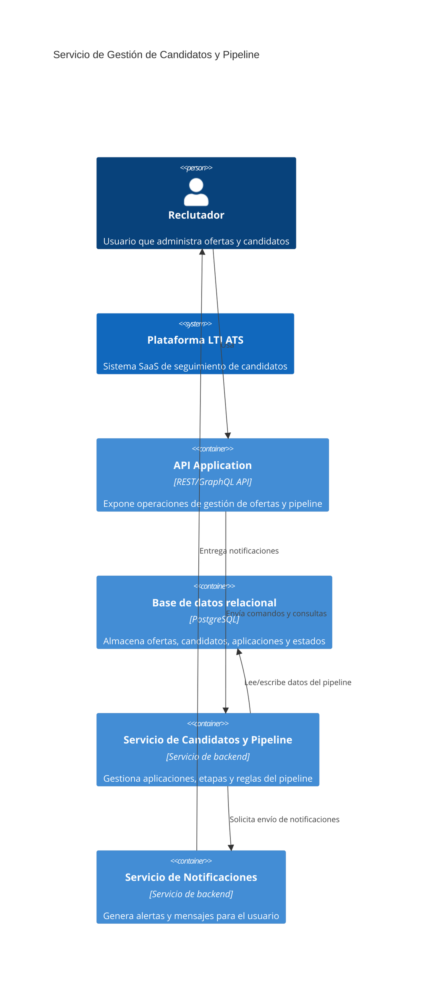

# LTI ATS — Software Requirements Guide (SRG)

## 1. Descripción breve del software LTI

LTI es un ATS (Applicant Tracking System) diseñado para pequeñas y medianas empresas, startups y equipos de talento que buscan modernizar la gestión del proceso de reclutamiento. La primera versión del sistema se enfoca en entregar una plataforma ágil y colaborativa que conecta publicaciones de empleo, candidatos, hiring managers y evaluadores dentro de un flujo organizado.

### Valor añadido
- Centraliza todas las etapas del reclutamiento en una única plataforma: publicación, recepción y evaluación de candidatos, seguimiento de pipeline y comunicaciones.
- Reduce el tiempo de selección gracias a la automatización de estados de candidato, alertas y análisis de brechas en el proceso.
- Facilita la colaboración entre reclutadores y hiring managers con herramientas de evaluación integradas y comentarios compartidos.

### Ventajas competitivas
- Interfaz simplificada y adaptada a equipos que no tienen experiencia con ATS complejos.
- Enfoque en la visibilidad del pipeline para decisiones rápidas y transparencia interna.
- Integración nativa con fuentes externas de candidatos (job boards, LinkedIn, formularios de empresas) desde el lanzamiento.
- Diseño modular que permite escalar la plataforma con nuevas funciones (evaluaciones técnicas, onboarding, employer branding) sin rehacer la arquitectura.

---

## 2. Funciones principales

1. **Gestión de ofertas de empleo**
   - Crear y publicar vacantes.
   - Definir requerimientos, competencias y etapas de selección.
   - Control de visibilidad y acceso a vacantes internas.

2. **Recepción y seguimiento de candidatos**
   - Registrar candidatos manualmente y recibir aplicaciones desde formularios o integraciones externas.
   - Asignar candidatos a procesos y etapas automatizadas.
   - Visualizar pipeline de candidatos con estado, prioridad y fecha de avance.

3. **Evaluación y selección**
   - Configurar entrevistas y evaluaciones con workflows.
   - Permitir calificaciones cualitativas y cuantitativas.
   - Generar comparativos de candidatos.

4. **Colaboración y comunicación**
   - Compartir notas internas entre reclutadores y hiring managers.
   - Enviar mensajes y actualizaciones a candidatos.
   - Notificaciones automáticas para acciones urgentes.

5. **Analítica y reportes**
   - Métricas de tiempo de proceso, tasa de conversión por etapa y origen de candidatos.
   - Panel de control compacto para decisiones del equipo.

---

## 3. Lean Canvas

| Bloque | Contenido |
|---|---|
| Problema | Procesos de reclutamiento fragmentados, pérdida de candidatos, baja colaboración interna. |
| Segmento de clientes | Startups, pymes, escuadras de recursos humanos, firmas de selección interna. |
| Propuesta de valor única | ATS simple, colaborativo y rápido que organiza procesos de contratación sin complejidad excesiva. |
| Solución | Plataforma web con pipeline visual, gestión de ofertas, evaluaciones integradas y notificaciones automáticas. |
| Canales | Ventas directas, marketplace SaaS, partnerships con consultoras de RRHH. |
| Flujo de ingresos | Suscripción mensual por usuario + tarifas premium por integraciones avanzadas. |
| Estructura de costos | Desarrollo del producto, hosting, soporte, marketing digital. |
| Métricas clave | Tiempo de cierre de vacantes, tasa de adopción por equipo, uso de pipeline, NPS. |
| Ventaja injusta | UX adaptada a equipos pequeños y un modelo modular que permite crecer sin balances pesados. |

---

## 4. Casos de uso principales

### 4.1 Caso de uso 1: Publicar oferta y gestionar candidatos

**Actores**: Reclutador, Hiring Manager.

**Descripción**: El reclutador crea una oferta, define etapas de selección y publica la vacante. Los candidatos son capturados y el reclutador gestiona su avance a través de las etapas.

### 4.2 Caso de uso 2: Evaluar y seleccionar candidatos

**Actores**: Reclutador, Hiring Manager, Evaluador.

**Descripción**: El equipo revisa aplicaciones, programa entrevistas y registra evaluaciones. Se generan puntajes y comentarios para seleccionar al mejor candidato.

### 4.3 Caso de uso 3: Coordinar al equipo de selección

**Actores**: Reclutador, Hiring Manager, Coordinador de RRHH.

**Descripción**: El equipo comparte feedback interno, recibe notificaciones y decide el avance de una vacante con información centralizada.

---

## 5. Modelo de datos

### Entidades y atributos

1. **Usuario**
   - id: UUID
   - nombre: string
   - correo: string
   - rol: enum (`reclutador`, `hiring_manager`, `evaluador`, `coordinador`)
   - empresaId: UUID
   - estado: enum (`activo`, `inactivo`)
   - fechaCreacion: datetime

2. **Empresa**
   - id: UUID
   - nombre: string
   - industria: string
   - tamaño: integer
   - plan: enum (`basic`, `pro`, `enterprise`)

3. **Oferta**
   - id: UUID
   - empresaId: UUID
   - titulo: string
   - descripción: text
   - ubicación: string
   - tipoContrato: enum (`full-time`, `part-time`, `contrato`, `prácticas`)
   - estado: enum (`borrador`, `publicada`, `cerrada`)
   - fechaPublicacion: datetime
   - fechaCierre: datetime

4. **Candidato**
   - id: UUID
   - nombre: string
   - correo: string
   - teléfono: string
   - origen: string
   - perfil: text
   - cvUrl: string
   - fechaRegistro: datetime

5. **Aplicación**
   - id: UUID
   - candidatoId: UUID
   - ofertaId: UUID
   - estado: enum (`nuevo`, `revisado`, `entrevista`, `oferta`, `rechazado`)
   - puntajeGlobal: integer
   - fechaAplicación: datetime
   - etapaActual: string

6. **Etapa**
   - id: UUID
   - ofertaId: UUID
   - nombre: string
   - orden: integer
   - tiempoObjetivo: integer

7. **Entrevista**
   - id: UUID
   - aplicaciónId: UUID
   - responsableId: UUID
   - fechaHora: datetime
   - formato: enum (`presencial`, `virtual`, `remoto`)
   - estado: enum (`programada`, `realizada`, `cancelada`)

8. **Evaluación**
   - id: UUID
   - entrevistaId: UUID
   - evaluadorId: UUID
   - criterios: json
   - puntaje: integer
   - comentario: text
   - fechaEvaluación: datetime

9. **ComentarioInterno**
   - id: UUID
   - aplicaciónId: UUID
   - autorId: UUID
   - texto: text
   - fechaCreacion: datetime

10. **Notificación**
    - id: UUID
    - usuarioId: UUID
    - tipo: string
    - contenido: text
    - leido: boolean
    - fechaEnvio: datetime

### Relaciones principales
- Un `Usuario` pertenece a una `Empresa`.
- Una `Empresa` publica muchas `Ofertas`.
- Una `Oferta` recibe muchas `Aplicaciones`.
- Un `Candidato` puede tener muchas `Aplicaciones`.
- Una `Aplicación` avanza a través de muchas `Etapas`.
- Una `Aplicación` puede tener varias `Entrevistas`.
- Una `Entrevista` genera una o más `Evaluaciones`.
- Una `Aplicación` puede tener varios `ComentariosInternos`.
- Un `Usuario` recibe varias `Notificaciones`.

---

## 6. Diseño del sistema a alto nivel

La primera versión del ATS se construirá como una aplicación web SaaS con los siguientes módulos principales:

- **Cliente web**: Interfaz responsive para reclutadores, hiring managers y coordinadores.
- **API de aplicación**: Endpoints REST/GraphQL para el frontend y las integraciones.
- **Servicio de gestión de ofertas**: Administra vacantes, etapas y reglas de publicación.
- **Servicio de pipeline y candidatos**: Controla aplicaciones, estados, calificaciones y movimientos entre etapas.
- **Servicio de evaluaciones**: Gestiona entrevistas, evaluadores, formularios y resultados.
- **Servicio de notificaciones**: Envía avisos internos y actualiza el estado de los usuarios.
- **Capa de datos**: Base de datos relacional para entidades principales y almacenamiento de documentos para CVs.
- **Integraciones externas**: Conectores para job boards, formularios web y sistemas de mensajes.

### Principios del diseño de alto nivel
- **Modularidad**: Cada dominio es independiente para evolucionar sin impactar todo el sistema.
- **Escalabilidad**: Separar lectura/escritura y priorizar cálculos de pipeline fuera del camino crítico.
- **Experiencia de usuario**: Reducir fricción en captura de candidatos y visibilidad del proceso.
- **Seguridad y control de acceso**: Roles claros y control de acceso a vacantes y datos de candidatos.

### Arquitectura visual

---

## 7. Diagrama C4 de un componente clave

### Componente elegido: Servicio de Gestión de Candidatos y Pipeline

Este componente concentra el flujo de aplicación, la gestión de etapas y la lógica que permite mover candidatos a través del proceso de selección.

### Subcomponentes dentro del Servicio de Gestión de Candidatos y Pipeline
- **Controlador de aplicaciones**: Recibe solicitudes de creación, actualización y cambio de estado.
- **Motor de etapas**: Valida las reglas del proceso y determina el siguiente paso del candidato.
- **Repositorio de pipeline**: Abstracción de acceso a datos para `Aplicación`, `Etapa` y `Candidato`.
- **Coordinador de notificaciones**: Emite eventos cuando cambia el estado de candidatos.
- **Adaptador de integraciones**: Normaliza aplicaciones entrantes desde fuentes externas.

---

## 8. Roadmap para la primera versión

- MVP 1: gestión de ofertas, registro de candidatos, pipeline básico y roles.
- MVP 2: evaluaciones de entrevistas, notificaciones internas y reportes simples.
- MVP 3: integraciones externas con job boards y mejoras de analítica.

**Nota**: El contenido generado se agrega en este documento `LTI-SRG.md` como artefacto de diseño inicial.
